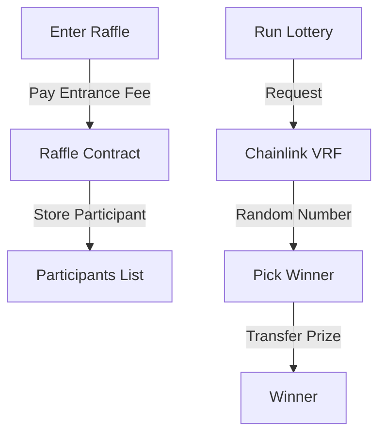

# 🎲 Raffle Smart Contract Documentation

## Table of Contents
- [Overview](#overview)
- [Contract Architecture](#contract-architecture)
- [Key Features](#key-features)
- [Technical Details](#technical-details)
- [Contract Interactions](#contract-interactions)

## Overview 🔍

The Raffle smart contract implements a decentralized lottery system using Chainlink VRF for verifiable random number generation. It allows participants to enter by paying an entrance fee and automatically distributes prizes to winners.

## Contract Architecture 🏗️



## Key Features ⭐

- **Fair Entry System**: Users can enter by paying a preset entrance fee
- **Multiple Entries**: Participants can increase their chances by entering multiple times
- **Verifiable Randomness**: Uses Chainlink VRF for transparent winner selection
- **Automatic Payouts**: Smart contract automatically transfers prize pool to winner
- **State Management**: Handles different raffle states (OPEN, CALCULATING)

## Technical Details 🛠️

### State Variables

| Variable | Type | Purpose |
|----------|------|---------|
| `NUM_WORDS` | uint32 | Number of random words (2) |
| `REQUEST_CONFIRMATIONS` | uint16 | VRF confirmations required (3) |
| `i_entranceFee` | uint256 | Minimum entry fee |
| `i_subscriptionId` | uint256 | Chainlink VRF subscription ID |

### Key Functions

```solidity
function enterRaffle() public payable
```
- Allows users to enter the raffle
- Requires minimum entrance fee
- Updates participant records

```solidity
function runLottery() external returns(uint256)
```
- Initiates the lottery drawing
- Requires minimum 2 participants
- Returns request ID for VRF

```solidity
function fulfillRandomWords(uint256 requestId, uint256[] calldata randomWords) internal
```
- Callback from Chainlink VRF
- Processes random number
- Selects and pays winner

### Events 📢

```solidity
event RandomNumberRequested(uint256 indexed reqId)
event WinnerPicked(address indexed winnderAddress)
```

### Error Codes ⚠️

```solidity
error Raffle__NotEnoughEtherToEnterRaffle()
error Raffle__Not_Ready_To_Start()
error Raffle__Winner_MoneyTransfer_Failed()
error Raffle__RaffleNotOpen()
error Raffle__VRFRequestFailed()
```

## Contract Interactions 🤝

### For Participants

```solidity
// Enter raffle
raffle.enterRaffle{value: entranceFee}()

// Check investment
uint256 myInvestment = raffle.getAmountInvestedByUser(address)

// View participants
address[] participants = raffle.getAllCurrentPerticipantsOfLottery()
```

### For Operators

```solidity
// Start lottery
uint256 requestId = raffle.runLottery()

// Check state
uint256 state = raffle.getCurrentStateOfRaffle()

// Get last winner
address winner = raffle.getLastWinner()
```

## Security Considerations 🔒

1. Uses CEI (Checks-Effects-Interactions) pattern
2. Implements reentrancy protection
3. Verifiable random number generation
4. Protected state transitions

## Gas Optimization ⚡

- Efficient storage usage with mappings
- Minimal array operations
- Optimized loop patterns
- Strategic use of view functions

---

*For more detailed information about deployment and testing, please refer to our [Deployment Guide](../guides/deployment.md) and [Testing Guide](../guides/testing.md).*