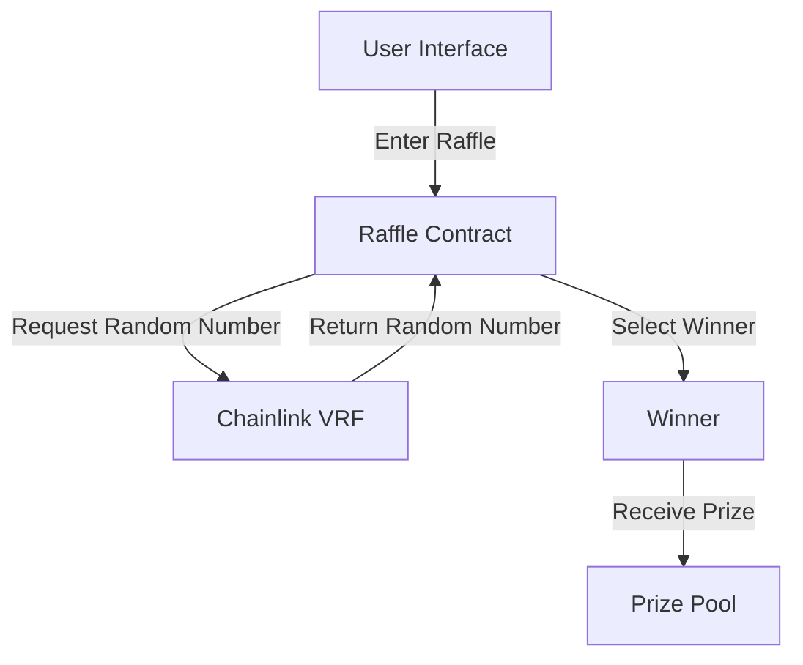
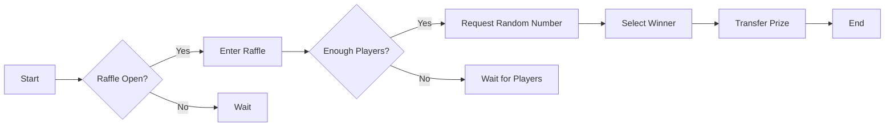
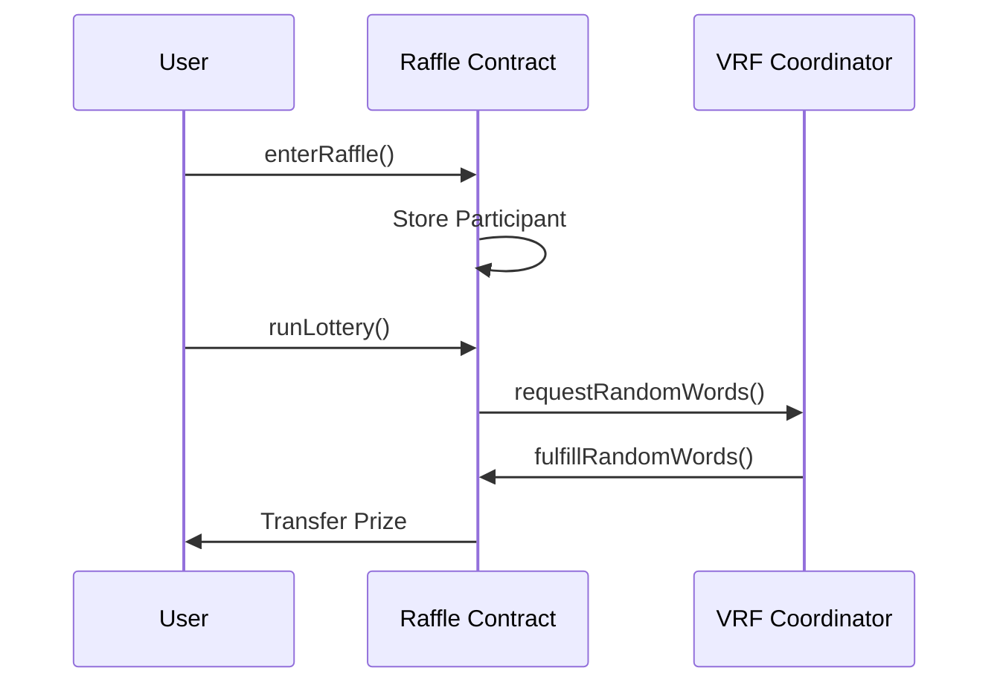
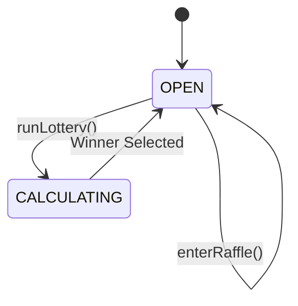

# 📊 Raffle Contract Diagrams

## Architecture Diagram

```mermaid
graph TD
    A[User Interface] -->|Enter Raffle| B[Raffle Contract]
    B -->|Request Random Number| C[Chainlink VRF]
    C -->|Return Random Number| B
    B -->|Select Winner| D[Winner]
    D -->|Receive Prize| E[Prize Pool]
```

## Flow Diagram

```mermaid
flowchart LR
    A[Start] --> B{Raffle Open?}
    B -->|Yes| C[Enter Raffle]
    B -->|No| D[Wait]
    C --> E{Enough Players?}
    E -->|Yes| F[Request Random Number]
    E -->|No| G[Wait for Players]
    F --> H[Select Winner]
    H --> I[Transfer Prize]
    I --> J[End]
```

## Sequence Diagram

```mermaid
sequenceDiagram
    participant U as User
    participant R as Raffle Contract
    participant V as VRF Coordinator
    
    U->>R: enterRaffle()
    R->>R: Store Participant
    U->>R: runLottery()
    R->>V: requestRandomWords()
    V->>R: fulfillRandomWords()
    R->>U: Transfer Prize
```

## State Diagram

```mermaid
stateDiagram-v2
    [*] --> OPEN
    OPEN --> CALCULATING: runLottery()
    CALCULATING --> OPEN: Winner Selected
    OPEN --> OPEN: enterRaffle()
```